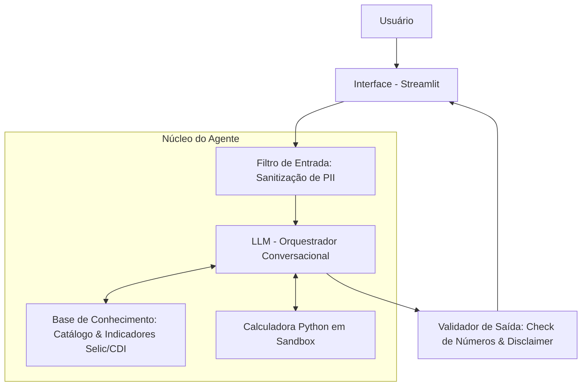

# 📄 Documentação Técnica Simplificada (FinAI)

## 1. Visão Geral
O **FinAI** é um assistente virtual educativo focado em finanças pessoais. Ele ajuda usuários a entenderem conceitos financeiros, simularem investimentos/financiamentos com **precisão matemática exata** e organizarem suas finanças sem jargões.

* **Princípio Core:** Respostas amigáveis e explicativas via LLM + Cálculos exatos via Python (sem alucinações matemáticas).
* **Público-Alvo:** Iniciantes em finanças (20–35 anos), recém-ingressos no mercado de trabalho e famílias organizando o orçamento.

---

## 2. Persona e Limites (Boundaries)

* **Nome:** FinAI
* **Tom de Voz:** Educativo, amigável, empático e neutro.
* **O que o FinAI FAZ:** Explica conceitos, realiza simulações matemáticas neutras e organiza históricos de gastos.
* **O que o FinAI NÃO FAZ (Limites Rígidos):**
  1. Não faz recomendação direta de investimento (compra/venda de ações/fundos).
  2. Não promete rentabilidade nem faz previsões de mercado.
  3. Não armazena nem aceita dados pessoais sensíveis (**PII** como CPF e senhas).
  4. Não substitui consultores certificados (CVM/Anbima).

---

## 3. Arquitetura Simplificada

### Componentes Básicos
1. **Filtro de Entrada:** Oculta dados pessoais (ex: CPF vira `[CPF-REDACTED]`).
2. **Orquestrador de Intenção:** Keywords determinísticos identificam simulações (financiamento, juros, gastos) versus consultas gerais.
3. **Calculadora Sandbox (Python):** Funções isoladas que fazem a matemática exata de juros compostos e financiamentos (SAC).
4. **Base de Conhecimento Estruturada:** Dados estáticos de produtos (CDB, Tesouro Direto) e indicadores de referência (SELIC, CDI, IPCA).
5. **LLM Conversacional (Ollama):** Fallback para dúvidas fora dos 3 fluxos de simulação. Fornece contexto educativo geral.
6. **Validador de Saída:** Garante que os números da resposta estejam corretos e insere o disclaimer obrigatório.

---

## 4. Pipeline do Agente (Fluxo de Execução)

1. **Entrada e Sanitização:** O usuário envia a mensagem. O filtro intercepta e remove qualquer CPF, e-mail ou dado sensível.
2. **Identificação da Intenção:** Orquestração por keywords determinísticos detecta se é simulação (financiamento/juros), análise de gastos, ou consulta geral. Sem LLM nesta etapa.
3. **Cálculo Determinístico:** Em simulações, a função Python é executada isoladamente e retorna os valores exatos (capital, juros, parcela).
4. **Resposta com Disclaimer:** Simulações retornam números + disclaimer. Consultas gerais são delegadas ao LLM (Ollama) para resposta conversacional.

---

## 5. Regras de Segurança e Qualidade

* **Zero Alucinação Numérica:** Toda matemática é realizada estritamente por código Python em sandbox (`simular_juros_compostos` ou `simular_financiamento_sac`).
* **Aviso Legal Obrigatório (Disclaimer):** Toda simulação deve obrigatoriamente incluir a nota:
  > *"Nota: Esta simulação é meramente informativa e demonstrativa, baseada nas taxas informadas. Não constitui recomendação de investimento ou proposta formal de crédito."*
* **Logs para Auditoria:** O sistema armazena apenas prompts sanitizados, funções executadas e resultados numéricos para fins de monitoramento e auditoria.
