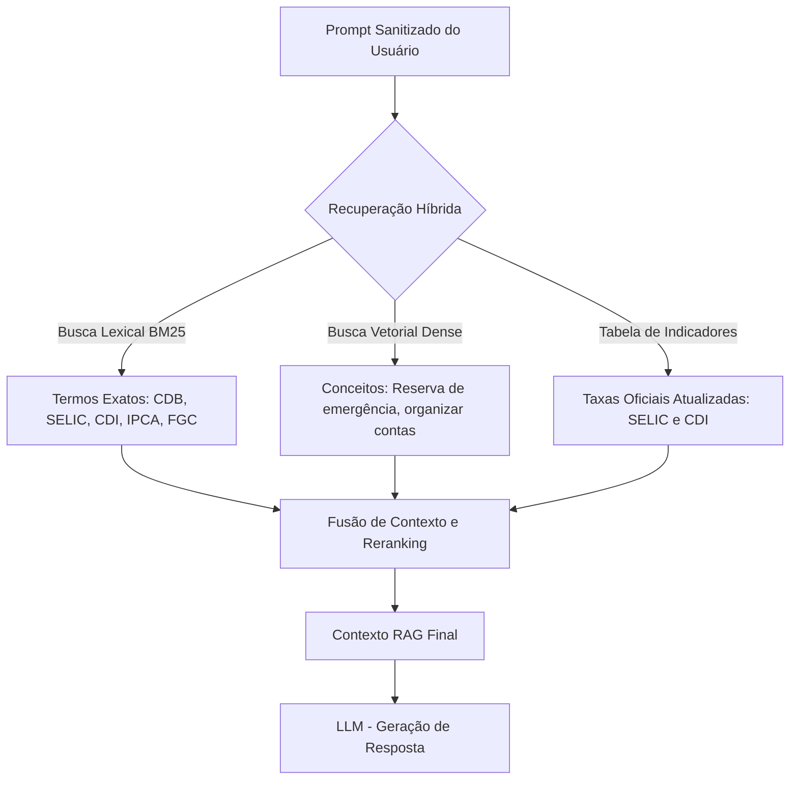

# 🧠 Documentação da Base de Conhecimento e Estratégia de Dados (FinAI)

## 1. Visão Geral e Objetivos de Dados

A base de conhecimento e a estrutura de dados do **FinAI** alimentam o motor conversacional (LLM) e a calculadora em sandbox com dados financeiros precisos, contextualizados e seguros.

O ecossistema atende a três propósitos fundamentais:
1. **Personalização da Experiência:** Orientar o usuário considerando seu perfil e objetivo (faixa etária de 20–35 anos, iniciantes em finanças, famílias).
2. **Confiabilidade e Precisão:** Manter taxas e produtos alinhados aos indicadores oficiais (SELIC, CDI, IPCA).
3. **Privacidade e Conformidade (LGPD):** Bloquear a persistência e processamento não autorizado de Dados Pessoais Identificáveis (PII).

---

## 2. Estrutura de Dados Estruturados (`data/`)

### A. Perfil do Cliente (`data/perfil_investidor.json`)
Caracterização simplificada de risco e metas do usuário para contextualizar as respostas do agente.

```json
{
  "cliente_id": "CLI-102938",
  "faixa_etaria": "25-30",
  "perfil_investidor": "Moderado",
  "meta_financeira": "Reserva de Emergência e Viagem",
  "horizonte_investimento": "Médio Prazo (1 a 3 anos)",
  "experiencia_previa": "Iniciante"
}
```

### B. Catálogo de Produtos Financeiros (`data/produtos_financeiros.json`)
Catálogo simplificado de produtos para consultas educativas e comparações neutras.

```json
[
  {
    "id": "PROD-01",
    "nome": "CDB Liquidez Diária",
    "categoria": "Renda Fixa",
    "indexador": "CDI",
    "rentabilidade": "100% do CDI",
    "risco": "Baixo",
    "liquidez": "Diária (D+0)",
    "garantia_fgc": true,
    "indicacao": "Reserva de Emergência"
  },
  {
    "id": "PROD-02",
    "nome": "Tesouro Selic 2029",
    "categoria": "Renda Fixa Pública",
    "indexador": "SELIC",
    "rentabilidade": "Selic + 0.05%",
    "risco": "Muito Baixo",
    "liquidez": "Diária (D+1)",
    "garantia_fgc": false,
    "indicacao": "Preservação de Capital"
  }
]
```

### C. Histórico de Transações (`data/transacoes.csv`)
Base de apoio para simulações de organização de orçamento doméstico.

```csv
data,categoria,descricao,valor,tipo
2026-08-01,Alimentacao,Supermercado Central,-250.00,Saida
2026-08-02,Transporte,Posto de Combustivel,-180.00,Saida
2026-08-03,Rendimento,Proventos CDB,+45.20,Entrada
2026-08-04,Lazer,Restaurante,-120.00,Saida
2026-08-05,Investimento,Aporte CDB Liquidez Diaria,-500.00,Saida
```

---

## 3. Estratégia de RAG Híbrido

Para responder dúvidas com precisão sem alucinar informações de produtos ou indicadores financeiros, o **FinAI** adota um mecanismo híbrido de busca:



### Componentes de Busca:
1. **Busca Lexical (BM25):** Garante a recuperação exata ao procurar por siglas técnicas e produtos específicos (CDB, LCI, LCA, IPCA, SELIC, FGC).
2. **Busca Vetorial (Embeddings):** Mapeia frases informais do usuário para conceitos financeiros educativos (ex.: *"como guardar dinheiro para imprevistos"* $
ightarrow$ *Reserva de Emergência*).
3. **Indicadores de Referência:** Mantém uma tabela atualizada com os valores vigentes da Taxa SELIC, CDI e Inflação (IPCA) para alimentação dos cálculos.

---

## 4. Governança, Proteção de Dados (LGPD) e Integridade

1. **Anonimização de PII na Entrada:** O sistema mascareia dados pessoais sensíveis antes do armazenamento ou envio ao LLM (ex.: substitui CPFs por `[CPF-REDACTED]`).
2. **Separação de Papéis:** O RAG serve apenas para contexto conceitual e informativo. Toda operação matemática e numérica é delegada à Calculadora Sandbox em Python.
3. **Trilha de Auditoria (Audit Trail):** Registro em log estruturado contendo apenas o prompt sanitizado, as ferramentas consultadas e os resultados numéricos retornados.
